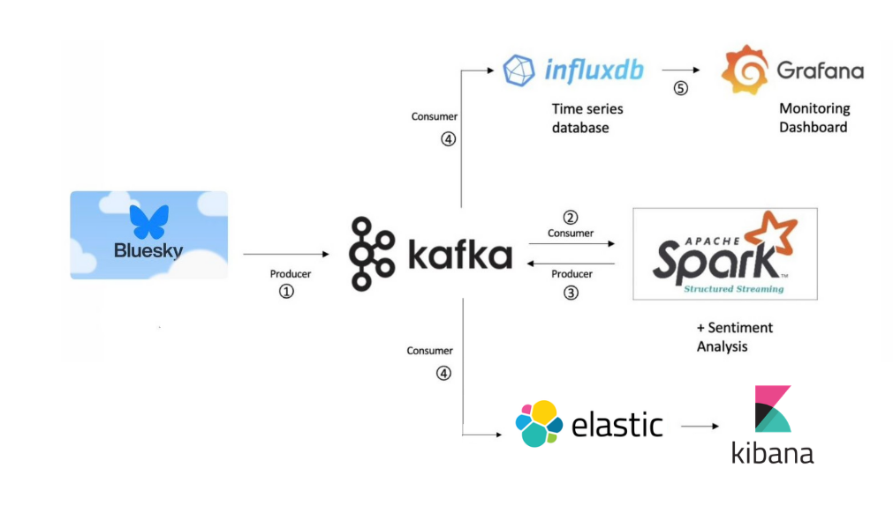
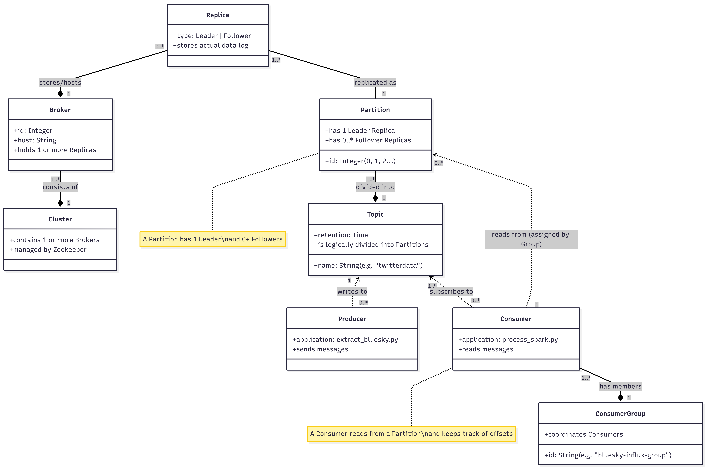

# 🦋 Bluesky NBA Real-Time Sentiment Analysis

A real-time data streaming pipeline that captures live posts from **Bluesky** regarding the **NBA**, performs sentiment analysis using **Apache Spark Structured Streaming**, and visualizes the results in **Grafana** via **InfluxDB**.

## 📖 Background
While watching the NBA playoffs and scrolling through social media, I wondered if I could gauge general fan sentiment in real-time. Originally designed for Twitter, this project now leverages the **Bluesky Jetstream** API to fetch live posts without rate-limit headaches. The project focuses on building a robust ETL pipeline using Kafka, Spark, and time-series databases.

## 🏗 Architecture

The pipeline consists of four main stages:



1.  **Ingestion:** Python script connects to Bluesky Jetstream (WebSocket) and filters for "NBA" posts in English.
2.  **Buffering:** Raw JSON data is pushed to Apache Kafka (Topic: `twitterdata`).
3.  **Processing:** PySpark reads the stream, cleans text, and calculates sentiment (Polarity/Subjectivity) using TextBlob.
4.  **Storage & Viz:** Processed data is sent back to Kafka, consumed by a loader script, stored in InfluxDB, and visualized in Grafana.

---

## 🛠 Technologies & Prerequisites

### Tools
*   **Language:** Python 3.8+
*   **Streaming Platform:** Apache Kafka & Zookeeper
*   **Processing Engine:** Apache Spark (PySpark 3.5.x)
*   **Database:** InfluxDB (Time Series) & Elasticsearch (NoSQL/Search)
*   **Visualization:** Grafana & Kibana
*   **Libraries:** `websockets`, `kafka-python`, `textblob`, `influxdb-client`

### Prerequisites
*   Java (JDK 8 or 11) is required for Kafka and Spark.
*   Docker (optional, but recommended for InfluxDB/Grafana).

---

## ⚙️ Installation & Setup

### 1. Python Environment
Create a virtual environment and install the dependencies:

```bash
pip install pyspark textblob python-dotenv
pip install kafka-python influxdb-client elasticsearch python-dotenv
```

### 2. Configuration (`.env`)
Create a `.env` file in the root directory. This keeps your credentials safe.

```ini
# --- KAFKA ---
KAFKA_BOOTSTRAP_SERVERS=localhost:9092
KAFKA_TOPIC=twitterdata
KAFKA_OUTPUT_TOPIC=twitterdata-clean
KAFKA_GROUP_ID=bluesky-group

# --- SPARK ---
SPARK_APP_NAME=BlueskySentimentAnalysis
SPARK_CHECKPOINT_DIR=/tmp/spark-checkpoint

# --- INFLUXDB ---
INFLUXDB_URL=http://localhost:8086
INFLUXDB_TOKEN=YOUR_INFLUX_TOKEN_HERE
INFLUXDB_ORG=YOUR_ORG_NAME
INFLUXDB_BUCKET=YOUR_BUCKET_NAME

# --- ELASTICSEARCH ---
ELASTICSEARCH_HOST=https://localhost:9200
ELASTICSEARCH_USER=elastic
ELASTICSEARCH_PASSWORD=YOUR_GENERATED_PASSWORD
ELASTICSEARCH_INDEX=twitter_dataset
```

### 3. Start Infrastructure

#### A. Kafka & Zookeeper (Terminal 1 & 2)
```bash
bin/zookeeper-server-start.sh config/zookeeper.properties
bin/kafka-server-start.sh config/server.properties
```

#### B. Elasticsearch & Kibana (Windows Example)
1.  **Start Elasticsearch:**
    ```cmd
    cd C:\Elastic\elasticsearch-8.x\bin
    .\elasticsearch.bat
    ```
    *Note the generated password for the `elastic` user.*

2.  **Start Kibana:**
    ```cmd
    cd C:\Elastic\kibana-8.x\bin
    .\kibana.bat
    ```

3.  **Link Kibana:**
    *   Generate enrollment token: `elasticsearch-create-enrollment-token.bat -s kibana`
    *   Open `http://localhost:5601` and enter the token.

4.  **Setup Index Pattern:**
    *   Go to **Stack Management > Data Views**.
    *   Create a data view for index: `twitter_dataset`.

**Option B: Start InfluxDB & Grafana**
```bash
# Mac (Homebrew)
brew services start influxdb
brew services start grafana-server
```

---

## 🚀 How to Run

Run the scripts in the following order using separate terminal tabs:

**Step 1: Start the Producer (Ingestion)**
Connects to Bluesky and sends data to Kafka.
```bash
python extract_bluesky_to_kafka.py
```

**Step 2: Start Spark Streaming (Processing)**
Reads from Kafka, applies sentiment analysis, and writes back to Kafka.
*Note: The script automatically handles the `spark-sql-kafka` package.*
```bash
spark-submit --packages org.apache.spark:spark-sql-kafka-0-10_2.12:3.5.0 process_spark_streaming.py
```

**Step 3: Start the Loader (Storage)**
Reads from the processed Kafka topic and saves to InfluxDB.
```bash
python load_kafka_to_influxdb.py
```

**Step 4: Visualize**
1.  Open Grafana (`http://localhost:3000`).
2.  Add InfluxDB as a Data Source (Flux language).
3.  Create a dashboard to query the measurement `bluesky_post`.
4.  Example query to count "Positive" butterflies:
    ```flux
    from(bucket: "YOUR_BUCKET") 
      |> range(start: -1h) 
      |> filter(fn: (r) => r["_measurement"] == "bluesky_post")
      |> filter(fn: (r) => r["polarity_cat"] == "Positive")
    ```

---

## 📸 Project Demo & Outputs

Here is the pipeline in action:

### 1. Data Ingestion (Terminal)
The Python Producer filters for posts and pushes them to Kafka.


### 2. InfluxDB Storage (Table View)
Processed sentiment data (polarity and subjectivity) stored in the database.


### 3. Real-Time Visualization InfluxDB (Video Demo)
[▶️ Click here to watch the InfluxDB Visualization Demo](docs/grafana.webm)

### 4.Real-Time Grafana Dashboard (Video Demo)
The video below demonstrates the live data flow, showing the sentiment analysis updating in real-time on the Grafana Dashboard.

[▶️ Click here to watch the Grafana Dashboard Demo](docs/1212.mp4)

### 5. Search & Analytics (Kibana & Elasticsearch)
Exploring the raw tweets and performing full-text search.
*(Screenshot of Kibana Discover tab showing `twitter_dataset`)*


### ⚡ Why is Kafka so fast?
## 🧠 Technical Concepts

### 🏗 Architecture Decision: Why Two Databases?
*   **InfluxDB:** Optimized for **Time Series**. It handles high write loads and is perfect for mathematical aggregations over time (e.g., "Average sentiment per minute").
*   **Elasticsearch:** Optimized for **Search**. It allows us to find specific tweets (e.g., "Find all negative tweets about 'Monarch'").

### ⚡ Kafka Speed & Architecture
Kafka acts as the central nervous system, decoupling the ingestion (Bluesky) from the processing (Spark) and the storage (Elastic/Influx). This ensures that if the database loader crashes, no data is lost; it remains buffered in Kafka.


### ⚡ 🏗 Kafka Internal Architecture


### 🌊 Handling Late Data (Watermarking)
In streaming, "Event Time" (when the post was written) differs from "Processing Time" (when Spark receives it).
*   **The Problem:** What if a post from 12:00 arrives at 12:05 due to network lag?
*   **The Solution:** Spark uses **Watermarking**.
    *   `df.withWatermark("ts", "10 seconds")` tells the engine: "Wait for late data up to 10 seconds. Anything older than that is dropped."
    *   This prevents the application from keeping infinite state in memory waiting for old data.

### 📊 Structured Streaming Modes
*   **Append Mode:** Only new rows are added to the result table. (Used in this project for writing to Kafka).
*   **Complete Mode:** The entire result table is rewritten every trigger. (Useful for aggregations/counts).
*   **Update Mode:** Only rows that changed are written.

---

## 🔮 Future Enhancements
*   **Dockerize:** Create a `docker-compose.yml` to launch Kafka, Spark, InfluxDB, and the Python scripts with one command.
*   **Better NLP:** Replace `TextBlob` with a pre-trained Transformer model (like BERT) for higher accuracy on slang/sports terms.
*   **Direct Sink:** Write from Spark directly to InfluxDB (skipping the second Kafka topic) to reduce latency.

## 📝 Credits
Inspiration and references taken from various Spark Streaming tutorials and the official documentation for Apache Kafka and InfluxDB.
